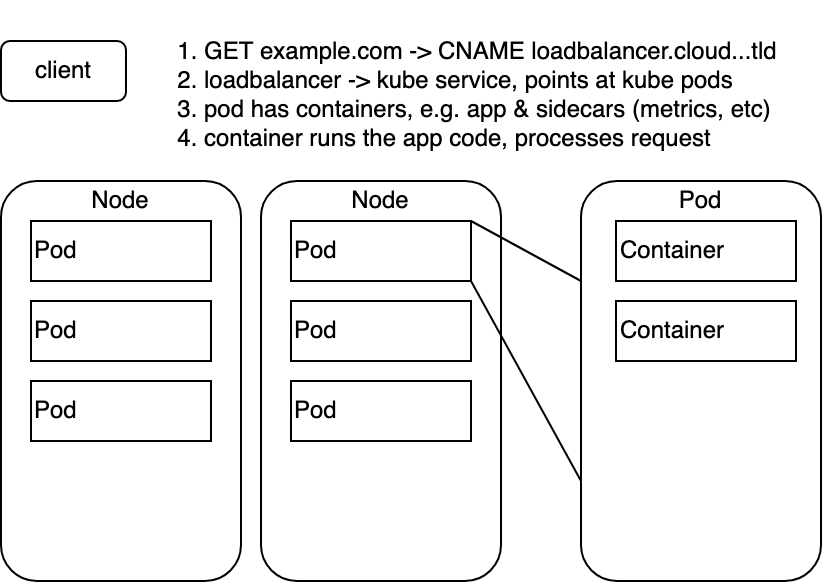

# Part 3

## 1

- Repository: <https://github.com/Walther/hello-dockermooc>
- Deployment: <https://hello-dockermooc.herokuapp.com/>


```yml
name: Deploy
on:
  push:
    branches:
      - main

jobs:
  build:
    runs-on: ubuntu-latest
    steps:
      - uses: actions/checkout@v2
      - uses: akhileshns/heroku-deploy@v3.12.12 # This is the action
        with:
          heroku_api_key: ${{secrets.HEROKU_API_KEY}}
          heroku_app_name: "hello-dockermooc"
          heroku_email: "veeti.haapsamo@gmail.com"
          usedocker: true
          branch: main
          region: eu
```

## 2

Using my "one exercise can be skipped per part" here. (Not particularly a fan of creating a script that would automatically publish projects into my public dockerhub profile.)

## 3

Backend

```Dockerfile
FROM golang:1.16

WORKDIR /go/src/app
COPY . .

RUN go build
ENV PORT 8080
ENV REQUEST_ORIGIN "http://localhost:4000"
EXPOSE 8080

RUN useradd -m appuser
USER appuser

CMD ["./server"]
```

Frontend

```Dockerfile
FROM node:14
RUN npm install -g serve
COPY . .
RUN npm install
ENV REACT_APP_BACKEND_URL "http://localhost:8080"
RUN npm run build
EXPOSE 5000

RUN useradd -m appuser
USER appuser

CMD ["serve", "-s", "-l", "5000", "build"]
```

## 4

Before optimization:

```
docker image ls
REPOSITORY                                   TAG       IMAGE ID       CREATED         SIZE
material-applications_example-frontend       latest    c95b2f95b12f   3 minutes ago   1.12GB
material-applications_example-backend        latest    e74d7e796ef9   3 minutes ago   934MB
```

After some mild optimization:

Frontend

```Dockerfile
FROM node:14-slim
COPY . .
ENV REACT_APP_BACKEND_URL "http://localhost:8080"
RUN \
  npm install -g serve && \
  npm install && \
  npm run build && \
  useradd -m appuser
EXPOSE 5000
USER appuser

CMD ["serve", "-s", "-l", "5000", "build"]
```

Backend

```Dockerfile
FROM golang:1.16

WORKDIR /go/src/app
COPY . .

RUN \
  go build && \
  useradd -m appuser && \
  rm -rf /usr/local/go && rm -rf /go/pkg && rm -rf ~/.cache/go-build
# These removals are kind of unnecessary, as multi-step builds are a better solution.

ENV PORT 8080
ENV REQUEST_ORIGIN "http://localhost:4000"
EXPOSE 8080
USER appuser

CMD ["./server"]
```

```
docker image ls
REPOSITORY                                   TAG       IMAGE ID       CREATED          SIZE
material-applications_example-backend        latest    20e84210b9f2   4 minutes ago    807MB
material-applications_example-frontend       latest    e4e33a211722   24 minutes ago   389MB
```

The backend image did not get much smaller, as a majority of the size comes from the go compilation tools themselves and such. This will get fixed in the next parts.

## 5

Switching to alpine, we get both images down to approx 300MB.

Backend

```Dockerfile
FROM golang:1.16-alpine

WORKDIR /go/src/app
COPY . .

RUN \
  go build && \
  adduser -D appuser && \
  rm -rf /usr/local/go && rm -rf /go/pkg && rm -rf ~/.cache/go-build
# These removals are kind of unnecessary, as multi-step builds are a better solution.

ENV PORT 8080
ENV REQUEST_ORIGIN "http://localhost:4000"
EXPOSE 8080
USER appuser

CMD ["./server"]
```

Frontend

```Dockerfile
FROM node:14-alpine
COPY . .
ENV REACT_APP_BACKEND_URL "http://localhost:8080"
RUN \
  npm install -g serve && \
  npm install && \
  npm run build && \
  adduser -D appuser
EXPOSE 5000
USER appuser

CMD ["serve", "-s", "-l", "5000", "build"]
```

```
docker image ls
REPOSITORY                                   TAG       IMAGE ID       CREATED              SIZE
material-applications_example-frontend       latest    bf637a14919c   About a minute ago   343MB
material-applications_example-backend        latest    8629d818a933   2 minutes ago        313MB
```

## 6

Frontend

```Dockerfile
FROM node:14-alpine as builder
COPY . .
ENV REACT_APP_BACKEND_URL "http://localhost:8080"
RUN \
  npm install && \
  npm run build

FROM node:14-alpine
COPY --from=builder /build /build
RUN \
  npm install -g serve && \
  adduser -D appuser
USER appuser
EXPOSE 5000
CMD ["serve", "-s", "-l", "5000", "build"]
```

```
docker image ls
REPOSITORY                                   TAG       IMAGE ID       CREATED              SIZE
material-applications_example-frontend       latest    895fdb4def5b   About a minute ago   126MB
```

Backend

```Dockerfile
FROM golang:1.16-alpine as builder
WORKDIR /go/src/app
COPY . .
RUN CGO_ENABLED=0 go build 

FROM scratch
COPY --from=builder /go/src/app/server /
ENV PORT 8080
ENV REQUEST_ORIGIN "http://localhost:4000"
EXPOSE 8080
CMD ["/server"]
```

```
docker image ls
REPOSITORY                                   TAG       IMAGE ID       CREATED          SIZE
material-applications_example-backend        latest    7847298b4858   45 seconds ago   17.1MB
```

## 7

I think ~76M is small enough for this rusty web server.

```Dockerfile
FROM rust:1.57 as builder
WORKDIR /usr/src/hello-dockermooc
COPY . .
RUN cargo install --path .

FROM ubuntu:21.10
COPY --from=builder /usr/local/cargo/bin/hello-dockermooc /usr/local/bin/hello-dockermooc
EXPOSE 8080
ENV PORT 8080
CMD ["hello-dockermooc"]
```

```
docker image ls
REPOSITORY                                   TAG       IMAGE ID       CREATED          SIZE
hello-dockermooc_web                         latest    6a89fafc2114   4 hours ago      76.1MB
```

I spent about an hour trying to get various smaller attempts working - with e.g. alpine, scratch, etc - but getting the various dependencies compiled correctly while not dynamically linking on libc and/or handling the libc dependency in the runner image etc gets difficult rather quickly.

## 8

Let's imagine:

- Two Nodes, e.g. EC2 instances on an ASG on AWS EKS
- Amount of Nodes could be scaled manually or automatically
- Running various Deployments, e.g.
  - a web application, hello-dockermooc or similar
  - influxdb for storing metrics, with a persistent volume claim
  - grafana for displaying metrics, querying the influxdb
- Each Deployment consisting of one or more Pods (HA + possible autoscaling etc)
- Some of the Pods running sidecar containers in addition to main workload, e.g. for metrics collection from the app
- Running an AWS ELB as a Kubernetes Service, as an entrypoint to the web application
- Route53 pointing a human-readable URL as a CNAME towards the ELB

This could be accomplished with a bunch of manual kubectl commands, or preferably, using something like Pulumi for better orchestration.

I apologize for the terrible diagram.

